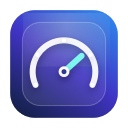
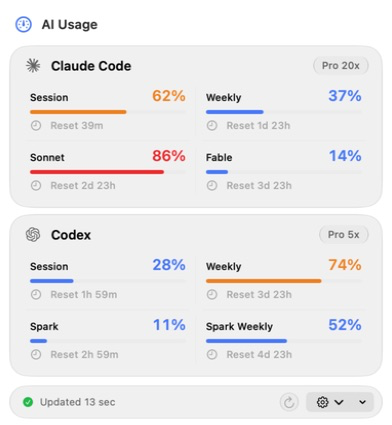

<p align="center">
  
</p>

<h1 align="center">AI Usage</h1>

<p align="center">
  <strong>Claude Code and Codex limits, one click away.</strong><br>
  A tiny, native macOS menu bar app with Liquid Glass.
</p>

<p align="center">
  
  
  <a href="LICENSE"></a>
</p>

<p align="center">
  
</p>

AI Usage shows the limits that matter and stays out of the way. No extra
account, API key, local server, telemetry, usage history, or background log
scanning.

## What you get

- Claude Code session, weekly, Sonnet, and Fable limits
- Codex session, weekly, Spark, and Spark weekly limits
- A provider icon and current percentage directly in the menu bar
- Five-minute automatic refresh and one-click manual refresh
- Native light and dark appearances with Liquid Glass
- Optional Launch at Login

## Install and run

You need:

- macOS 26 or newer
- Xcode 27 or newer
- Claude Code and/or Codex already signed in locally

Then:

```bash
git clone https://github.com/burakgon/ai-usage-menubar.git
cd ai-usage-menubar
./scripts/install.sh
```

The script builds a local Release version, installs it to
`~/Applications/AI Usage.app`, and opens it. AI Usage appears in the menu bar,
not the Dock.

To run without the installer, open `AIUsage.xcodeproj` in Xcode and run the
`AIUsage` scheme.

## How it works

AI Usage reads the same local OAuth credentials already created by the
`claude` and `codex` CLIs, then requests quota data directly from the
providers' first-party endpoints.

- Credentials stay on your Mac.
- Tokens are never printed, logged, or sent anywhere else.
- Temporary failures keep the last successful values in memory and mark them
  stale.
- Nothing is cached across launches.

API-key-only Codex authentication can't read ChatGPT subscription usage.
`CLAUDE_CODE_OAUTH_TOKEN` is intentionally ignored because setup tokens don't
include the profile scope required by Claude's usage endpoint.

The exact researched contracts are documented in
[docs/provider-contracts.md](docs/provider-contracts.md).

## Menu bar behavior

The default **Auto** mode shows the highest available current session usage.
You can pin the menu bar indicator to Claude Code or Codex from Settings.

Raw percentages are shown exactly as reported by the provider. Only progress
bar drawing is clamped to `0...100`.

## Development

Run the complete test suite:

```bash
xcodebuild test \
  -project AIUsage.xcodeproj \
  -scheme AIUsage \
  -destination 'platform=macOS'
```

The app intentionally has no package dependencies. It is SwiftUI and AppKit,
with a small provider layer and an in-memory store.

Contributions are welcome. Please read [CONTRIBUTING.md](CONTRIBUTING.md)
before opening a pull request.

## Upstream research

Provider contracts and parts of the system-boundary implementation were
adapted from [OpenUsage](https://github.com/robinebers/openusage), pinned to
tag `v0.7.6` / commit `5a2864f19a1c664f6a140ba06abad5596000af10`.
See [NOTICE](NOTICE) for attribution.

## License

AI Usage is available under the [MIT License](LICENSE).

---

If AI Usage saves you a few clicks, please
[star the repository](https://github.com/burakgon/ai-usage-menubar). It helps
other Claude Code and Codex users find it.
